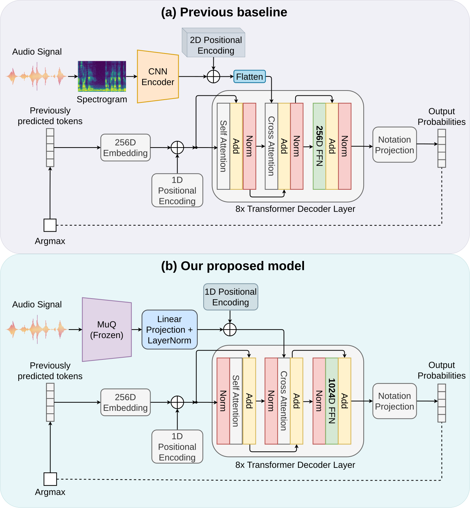

# HookKern

<div>
  <a href='#'></a>
  <a href='#'></a>
  <a href='#'></a>
  <a href='https://pytorch.org/'></a>
  <a href='LICENSE'></a>
</div>


This is the official repository for the paper *"**Audio-to-Score Transcription using Pre-trained Features, Data Augmentation, and the New Hooktheory-A2S Dataset**"*.

In this repo, the following are released:

- **HookKern**: a transformer for audio-to-score transcription that maps raw audio to Humdrum `**kern` notation.
- **Encoder variants**: a CNN encoder variant and a [MuQ](https://github.com/tencent-ailab/MuQ)-based based variant.
- Training, evaluation, and inference code. 


## Overview

We introduce **Hooktheory-A2S**, the first audio-to-score (A2S) dataset for popular music: 61 hours of real, commercially released audio paired with `**kern` lead-sheet encodings across 6,066 songs. Unlike existing A2S datasets, which rely on synthetic recordings of Western classical music, Hooktheory-A2S is built from real audio and isolates the sung melody together with its chords.

We also propose an **A2S model** that improves on prior work with three changes to an autoregressive transformer decoder: a larger ff dim, pre-norm decoder, using [MuQ](https://github.com/tencent-ailab/MuQ) as an encoder in place of the CNN, and pitch/tempo data augmentation. The model reaches 4.98% symbol error rate on the classical Quartets collection and sets a 20.92% benchmark on Hooktheory-A2S.

For more details, please refer to our [paper](#).

<div>
  
  <!--  -->
</div>

## Usage

### Installation

**Option A — Docker (recommended).** 

```bash
docker build -t hookkern .
docker run -it --gpus all --ipc=host -v /path/to/data:/path/to/data hookkern bash
```

**Option B — pip.** Requires `python>=3.11`, a CUDA-capable GPU, and the system packages
`ffmpeg`, `fluidsynth`, and (for augmentation only) `rubberband-cli`.

```bash
pip install -r requirements.txt
```


### 1. Preprocess audio into MuQ features (optional)

Precompute MuQ features so training does not run the (frozen) MuQ encoder every step.
Required for the `preprocessed_muq` encoders.

```bash
python preprocess_muq.py --input-dataset /path/to/dataset --output-dir /path/to/output
```

By default the input is read with `load_from_disk`. Use `--no-from-disk` to pull a dataset from
the Hub instead (in which case `--output-dir` is required).

> **Note:** MuQ features are always extracted in 32-bit precision. Although training otherwise
> runs in 16-bit mixed precision, MuQ is executed with autocasting disabled both here and
> on-the-fly during training if you skip this step, since half precision produces NaN values in
> its output.

### 2. Train

Hooktheory-A2S (lead sheets) with the precomputed-MuQ encoder:

```bash
python train.py \
    --ds_location /path/to/dataset \
    --encoder preprocessed_muq \
    --tokeniser word \
    --batch_size 8 \
    --learning_rate 5e-5 \
    --weight_decay 1e-3 \
    --ff_dim_multiplier 4 \
    --label_smoothing 0.1 \
    --patience 5
```

To use the raw-spectrogram CNN encoder instead, pass `--encoder cnn` (no preprocessing needed).

For the **Quartets** dataset, use `--tokeniser original` (this applies the cleaning from
the original quartets paper together with word-level tokenisation):

```bash
python train.py \
    --ds_location /path/to/quartets \
    --encoder preprocessed_muq \
    --tokeniser original \
    --batch_size 8 \
    --learning_rate 5e-5 \
    --weight_decay 1e-3 \
    --ff_dim_multiplier 4 \
    --patience 5
```

> **Batch size** must be one of `1, 2, 4, 8`. For values below 8, gradient accumulation is
> applied automatically to keep an effective batch size of 8. Checkpoints are written to
> `weights/<encoder>/` and training is logged to Weights & Biases (`wandb login`, or set
> `WANDB_MODE=offline`).

Valid **encoders**: `cnn`, `muq`, `preprocessed_muq`,
Valid **tokenisers**: `word`, `medium`, `original`.
### 3. Evaluate

Compute metrics (Sym-ER, MV2H) on the test set.

```bash
# Lead sheets (Hooktheory-A2S)
python run_metrics.py \
    --checkpoint_path /path/to/checkpoint.ckpt \
    --ds_location /path/to/dataset \
    --encoder preprocessed_muq \
    --tokeniser word \
    --dataset_type lead_sheet

# String quartets
python run_metrics.py \
    --checkpoint_path /path/to/checkpoint.ckpt \
    --ds_location /path/to/quartets \
    --encoder preprocessed_muq \
    --tokeniser original \
    --dataset_type quartets
```

### 4. Sample / visualise predictions

Run inference sample-by-sample, printing ground-truth and predicted tokens together with
[Verovio Humdrum Viewer](https://verovio.humdrum.org/) links that render the output as sheet music.

```bash
python sample.py \
    --checkpoint_path /path/to/checkpoint.ckpt \
    --ds_location /path/to/dataset \
    --tokeniser word \
    --number 5
```

`--number` limits how many samples are printed.

### 5. Data augmentation (optional)

Pitch/tempo augmentation of the quartets dataset. Requires the Humdrum `transpose` tool and the
`rubberband` CLI on your `PATH`.

```bash
python augment_existing_hf_dataset.py --output-path /path/to/augmented
```

## Performance

Model performance on the Hooktheory-A2S and Quartets datasets using the word-level tokenisation
scheme.
### SER (overall)

| Method | Hooktheory-A2S | Quartets |
| ------ | :------------: | :------: |
| Baseline | 66.85 | 15.3 |
| + 1024 Pre-Norm | 53.7 | 8.48 |
| + MuQ encoder | 25.39 | 7.16 |
| + Augmented data | **20.92** | **4.98** |

### Per-spine SER and MV2H (Hooktheory-A2S)

Per-spine SER (melody and chord spines) and MV2H on Hooktheory-A2S. Lower is better for SER;
higher is better for MV2H.

| Variant | Normal SER | Melody SER | Chord SER | MV2H |
| ------- | :--------: | :--------: | :-------: | :--: |
| Baseline | 66.85 | 106.88 | 64.12 | 70.39 |
| + 1024 Pre-Norm | 53.7 | 90.56 | 51.8 | 72.62 |
| + MuQ | 25.39 | 46.21 | 26.76 | 79.38 |
| + Augmented | **20.92** | **38.62** | **22.28** | **85.05** |


## Datasets & Checkpoints

Datasets and model checkpoints are hosted on the Hugging Face Hub. 

https://huggingface.co/collections/MMR-Lab/sheetsage-a2s

> **Note:** if `huggingface.co` is unreachable,
> set the mirror endpoint before downloading:
>
> ```bash
> export HF_ENDPOINT=https://hf-mirror.com
> ```
## License

The code in this repository is released under the MIT license as found in the [LICENSE](LICENSE) file.

## Citation


```
@article{TODO,
      title={TODO: paper title},
      author={TODO},
      journal={TODO},
      year={2026}
}
```

## Acknowledgement
- [MuQ](https://github.com/tencent-ailab/MuQ) — pretrained music audio encoder.
- The kern tokeniser adapts code from [ISMIR-Jazzmus](https://github.com/JuanCarlosMartinezSevilla/ISMIR-Jazzmus).
- We also borrow code from [a2s-transformer](https://github.com/mariaalfaroc/a2s-transformer).
